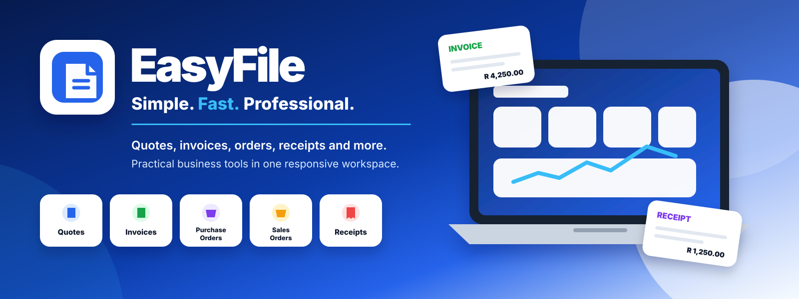

<div align="center">
  

  # EasyFile

  **Simple. Fast. Professional business paperwork and operational tools.**

  [Open EasyFile](https://www.easyfile.co.za/) · [Referral Access](https://www.easyfile.co.za/referrals.html) · [Report an Issue](https://github.com/Easy-Online-Office/site/issues)
</div>

## Overview

EasyFile is a responsive, local-first suite of browser-based tools for creating business documents and managing everyday operational records. The main landing page provides module search, direct launch controls, a responsive global navigation bar, dark/light themes and access to the referral dashboard.

The product is designed for small businesses, independent professionals and operational teams that need practical tools without a heavyweight ERP deployment.

## Modules

| Sales and finance | Operations and records |
| --- | --- |
| Quotes | Job cards |
| Invoices | Payroll |
| Purchase orders | Inventory |
| Sales orders | CRM |
| Receipts | Asset management |
| Statements | Site inspections |

## Referral access model

EasyFile uses a referral-based access mechanism:

1. A user receives one qualifying use across the EasyFile module suite.
2. After the free use is consumed, the user shares a unique referral link.
3. Three different referred users must enter through that link and complete a qualifying action such as Save, Preview, Print or Export.
4. The original user receives continued EasyFile access after all three referrals qualify.

Referral identity, status and entitlement checks are handled by the EasyFile referral service. The browser retains a cached entitlement so an already-unlocked account can tolerate a temporary service interruption.

## Navigation and user interface

The shared topbar is generated by `scripts/sync-nav.js` and provides:

- EasyFile logo and product identity
- Desktop and mobile navigation
- Module search with keyboard shortcut support (`/` or `Ctrl/Cmd + K`)
- Referral dashboard access
- Dark/light theme switching
- Responsive burger-menu controls

Shared navigation styles are maintained in `assets/css/easyfile-navigation.css`.

## Technology

- HTML5, CSS3 and vanilla JavaScript
- Tailwind CSS utility classes where applicable
- Font Awesome icons
- Browser LocalStorage for module working data and preferences
- Static hosting compatible with GitHub Pages or a conventional web server
- Referral API integration configured through `assets/js/easyfile-referral-config.js`

## Local development

```bash
git clone https://github.com/Easy-Online-Office/site.git
cd site
python -m http.server 8080
```

Open `http://localhost:8080` in a browser.

## Deployment

The repository is a static site. Deploy the repository root through GitHub Pages or copy the files to the document root used by `www.easyfile.co.za`.

For GitHub Pages:

1. Open **Settings → Pages**.
2. Select the production branch and repository root.
3. Confirm the custom domain and HTTPS settings.
4. Verify `/`, `/referrals.html` and each module URL after deployment.

## Privacy and security notes

- Most module data is retained in the user’s browser rather than a central application database.
- Clearing browser storage can remove locally stored drafts and preferences.
- Referral validation requires network access and must be treated as a server-authoritative entitlement check.
- Do not store secrets, payment-card data or highly sensitive personal information in browser storage.
- Production deployments should enforce HTTPS, a restrictive Content Security Policy and appropriate API CORS controls.

## Independent product notice

EasyFile is an independent business-software product and is not affiliated with, endorsed by or operated by the South African Revenue Service or SARS e@syFile.

## Licence

Distributed under the MIT Licence. See [`LICENSE`](LICENSE).

---

<div align="center">
  Maintained by <a href="https://github.com/Easy-Online-Office">Easy Online Office</a> and contributors.
</div>
